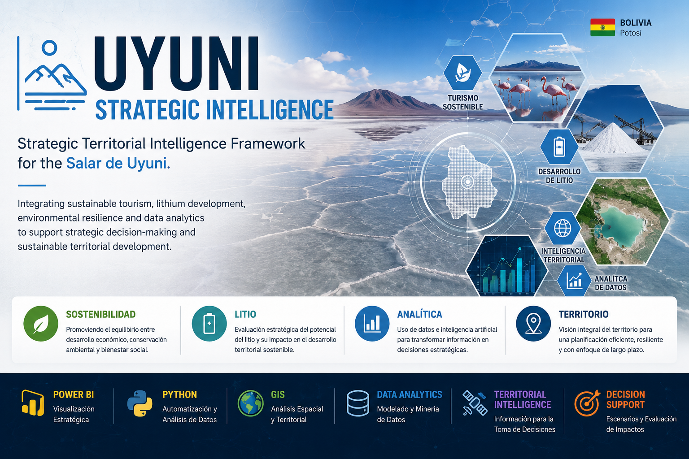

# 📊 Análisis Estratégico del Modelo de Desarrollo del Salar de Uyuni

**Turismo Sostenible vs. Explotación Extractiva de Litio**

Análisis estratégico y dashboard en Power BI para evaluar los modelos de desarrollo en el Salar de Uyuni, Bolivia, utilizando datos, modelamiento analítico y visualización avanzada.

---

## 📄 Documentación Ejecutiva

Este proyecto incluye una síntesis profesional orientada a la toma de decisiones, diseñada para una comprensión rápida del análisis y sus implicaciones estratégicas.

🔍 Incluye:

* 📘 Resumen ejecutivo del análisis
* 📊 Presentación del dashboard en formato profesional
* 📈 Principales hallazgos estratégicos

📥 Acceso directo:

* 👉 [Resumen Ejecutivo](./docs/Resumen_Ejecutivo_Salar_Uyuni.pdf)
* 👉 [Dashboard Ejecutivo](./docs/Dashboard_Ejecutivo_Salar_Uyuni.pdf)

---

## 📖 Resumen del Proyecto

Este repositorio contiene un análisis integral y una herramienta de Business Intelligence desarrollada en Power BI para evaluar la encrucijada estratégica que enfrenta el Salar de Uyuni.

El objetivo es comparar de manera objetiva dos modelos de desarrollo:

* 🌱 Turismo sostenible (horizonte de largo plazo)
* ⛏️ Explotación de litio (ciclo extractivo finito)

Este proyecto transforma datos provenientes de fuentes oficiales, reportes técnicos y proyecciones metodológicas en una plataforma interactiva que facilita la toma de decisiones basada en evidencia.

---

## 🚀 Hallazgos Clave

* **Paridad de ingresos, disparidad de impacto:**
  Ambos modelos proyectan ingresos anuales similares (~$200M USD), pero presentan diferencias significativas en impacto social y ambiental.

* **Multiplicador social del turismo:**
  El turismo genera aproximadamente **2.6 veces más empleo** que el modelo extractivo en fase operativa.

* **Riesgo hídrico crítico:**
  La Matriz de Leopold identifica impactos significativos del modelo extractivo sobre los recursos hídricos.

* **Resiliencia del turismo:**
  El análisis contrafactual evidencia la capacidad de recuperación y crecimiento del sector turístico.

---

## 🛠️ Componentes Técnicos y Metodología

Este análisis fue desarrollado utilizando herramientas modernas y metodologías avanzadas:

* **Modelado de datos:**
  Diseño de modelo estrella para optimizar rendimiento y consistencia.

* **Business Intelligence:**
  Desarrollo en Power BI con medidas DAX avanzadas.

* **Análisis avanzado:**

  * Análisis contrafactual
  * Matriz de Impacto Ambiental (Leopold)

* **Inteligencia Artificial:**
  Uso de modelos generativos como soporte en estructuración analítica y narrativa.

---

## 📂 Estructura del Repositorio

* `/data` → Datos fuente en formato `.csv`
* `/report` → Reporte final y propuesta técnica
* `/visuals` → Imágenes del dashboard y demostraciones
* `/docs` → Documentación ejecutiva (PDFs)
* `Salar_de_Uyuni_Analisis.pbix` → Archivo fuente de Power BI

---

## 🧑‍💻 Sobre el Autor

**Víctor Hugo Villegas Ríos**
Consultor Freelance en Análisis y Ciencia de Datos

Especialización en:

* 📊 Power BI
* 📈 Análisis de datos
* 🌱 Evaluación ambiental

🔗 LinkedIn:
https://www.linkedin.com/in/victorhugovillegasrios/

---

## 🎯 Enfoque del Proyecto

Este proyecto fue desarrollado como un caso de estudio independiente, con el objetivo de demostrar cómo el análisis de datos puede aportar valor en la evaluación de políticas de desarrollo territorial y toma de decisiones estratégicas.

---

